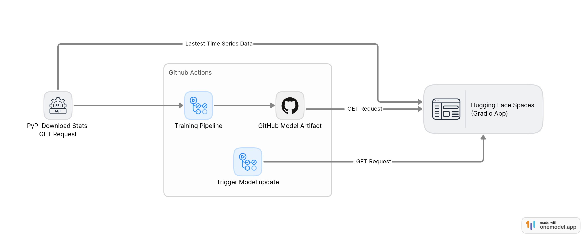
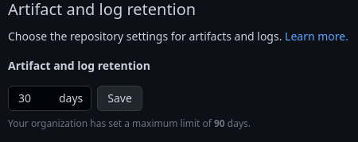
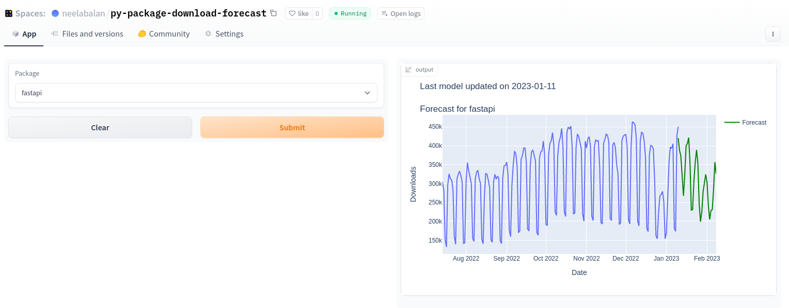

> HuggingFace Spaces YAML Front matter config


# py-package-download-forecast

[](https://github.com/neelabalan/py-package-download-forecast/actions/workflows/upload_artifact.yml)
[](https://github.com/neelabalan/py-package-download-forecast/actions/workflows/sync_hf_spaces.yml)


## Workflow



Generates best ARIMA model every week based on the latest data from **PyPI Stats API**. The model training happens on the recent data and forecast is done for next 30 days.

Github artifact is used to store the models. The Gradio application hosted in HugginFace Spaces calls the [Github Artifact API](https://docs.github.com/en/rest/actions/artifacts?apiVersion=2022-11-28#list-artifacts-for-a-repository) to download the latest set of models.

> Note: The artifact retention days is set to 30 and can be configured from the project settings
>



___


___

## Config

```toml
# Set of packages for which model is trained and downloads is forecasted
packages = ["fastapi", "flask", "requests", "pytorch", "tensorflow"]

# github username
username = "neelabalan"

# repository name of project
repo_name = "py-package-download-forecast"

# Forecast steps
forecast_days = 30

# 'm' values to try for best model
m_values = [3, 6]
```

## Reference

- [PyPI Stats API](https://pypistats.org/api/)
- [Analysing PyPI package downloads](https://packaging.python.org/en/latest/guides/analyzing-pypi-package-downloads/)
- [Python package index dataset](https://console.cloud.google.com/marketplace/product/gcp-public-data-pypi/pypi?pli=1)
- [Analyzing Python package downloads in BigQuery (Blog)](https://cloud.google.com/blog/topics/developers-practitioners/analyzing-python-package-downloads-bigquery)
- [Steps to get the register BigQuery](https://github.com/ofek/pypinfo/blob/master/README.rst#installation)